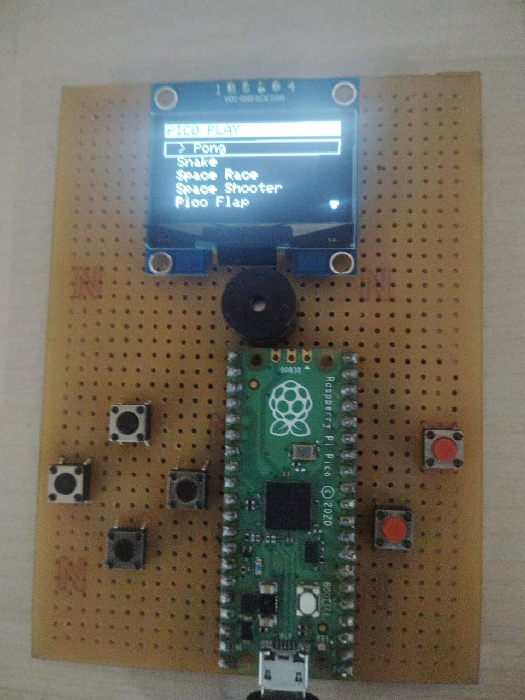
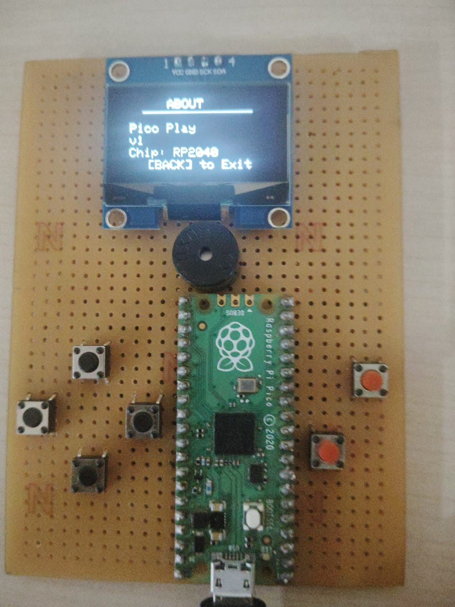

# PicoPlay (v1) 🕹️

PicoPlay is a DIY handheld gaming console built on the Raspberry Pi Pico (RP2040). This is the first iteration (v1). The firmware is currently a single-file Arduino sketch featuring a dual-mode system that functions as both a standalone console and a USB HID Gamepad.





## 📂 Repository Structure

```text
PicoPlay/
├── src/
│   └── PicoPlay.ino    # The complete source code
├── images/             # Project Images
└── README.md
```

## ⚙️ Hardware Specs

  * **Microcontroller:** Raspberry Pi Pico (RP2040)
  * **Display:** 1.3-inch OLED (I2C)
  * **Input:** Tactile Switches (Direct GPIO)
  * **Audio:** Piezo Buzzer (Hardware installed on GP0, software support pending)
  * **Power:** USB (5V)

## 🎮 Features

### 1\. Dual-Mode Functionality

  * **Console Mode:** Runs embedded games directly on the device.
  * **Controller Mode:** Uses `Adafruit_TinyUSB` to act as a generic USB Gamepad. Connects to Windows/Linux/Android as a standard HID device.

### 2\. Games Library

Current Games included in the source:

  - [x] Pong
  - [x] Snake
  - [x] Space Race
  - [x] Space Shooter
  - [x] Pico Flap
  - [x] Dino Run

## 🛠️ Wiring / Pinout

### Peripherals

  * **Display (1.3" OLED):**
      * **SDA:** GP4
      * **SCL/SCK:** GP5
  * **Buzzer:** Connected to **GP0**

### Button Map

| Button Function | Pico Pin (GP) |
| :--- | :--- |
| UP | 19 |
| DOWN | 28 |
| LEFT | 16 |
| RIGHT | 26 |
| A (OK) | 6 |
| B (BACK) | 15 |

## 🚀 Roadmap

  - [ ] **Bare Metal Port:** The ultimate goal is to rewrite the entire firmware in C using the Pico SDK (removing Arduino overhead).
  - [ ] **Audio Update:** Update firmware to drive the buzzer (GP0) for game SFX.
  - [ ] **UI Polish:** Improve menu navigation and animations.
  - [ ] **Enclosure**: Design a 3D printable Enclosure for it.
  - [ ] **Games**: Create more games and explore emulation capabilities.

## 📜 License

This project is licensed under the **MIT License** - see the LICENSE file for details.
